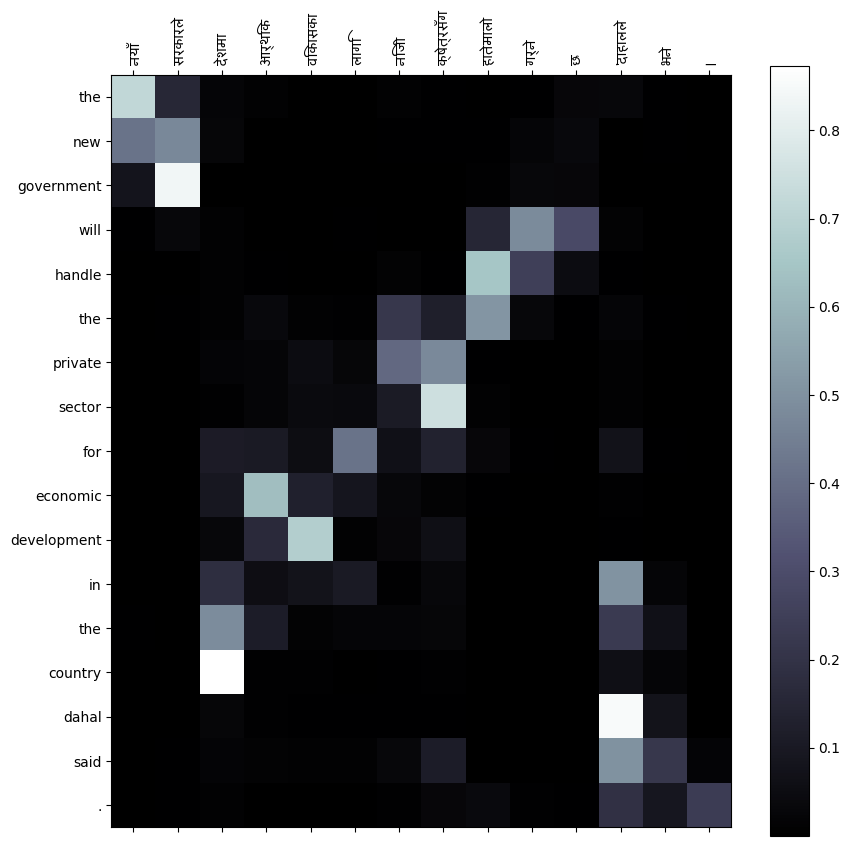
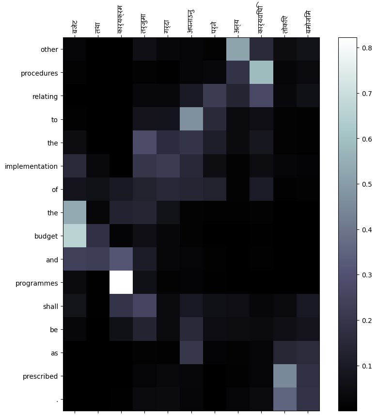
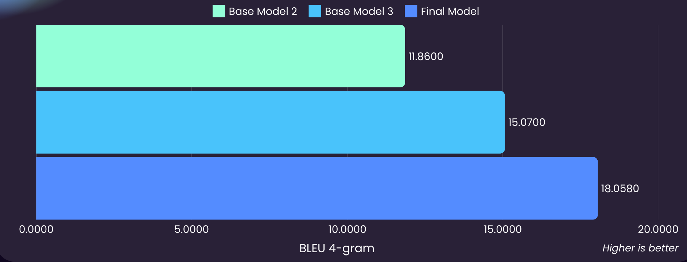

# Neural Machine Translation

<div align="center">

    

</div>


This repository provides an implementation of the paper *__Neural Machine Translation by Jointly Learning to Align and Translate__*. The script is designed to handle any language pair for translation tasks and also support for distributed GPU training using **Lightning AI**.

## Usage

#### 1. Install Dependencies  

```bash
sudo apt-get install -y fonts-noto-core fonts-noto-unhinted fonts-noto-hinted libcairo2 libcairo2-dev libpango1.0-dev libglib2.0-dev
pip install -r requirements.txt
```

#### 2. Prepare the Dataset

> [!NOTE]  
> The dataset script reads the dataset file in __TSV__ format.

Foe English to Nepali dataset, you can download the dataset from [__here__](https://drive.google.com/drive/folders/1iqhugLp0wwZau5Q2p5ju-z__C0t6XqCV?usp=sharing), and obtain the Nepali font from [__here__](https://nepalifonts.net/fonts/mangal-regular).

#### 3. Train the Model  
Before starting, add your **Comet ML API key** and **project name** to the `.env` file.

| **Argument**          | **Description** | **Default Value** |
|----------------------|-----------------|------------------|
| `-d`, `--device` | Device for training | `cuda` |
| `-g`, `--gpus` | Number of GPUs per node | `1` |
| `-w`, `--num_workers` | Number of data loading workers | `8` |
| `-db`, `--dist_backend` | Distributed backend for multi-GPU training | `ddp` |
| `--train_path` | Path to the training dataset (TSV format) | None (required) |
| `--valid_path` | Path to the validation dataset (CSV format) | None (required) |
| `--font_path` | Path to the font file (.ttf), useful for Devanagari scripts | None (required) |
| `--input_lang` | Source language | `np` |
| `--output_lang` | Target language | `en` |
| `--reverse` | Reverse source and target languages | `False` |
| `--max_len` | Maximum sequence length | `12` |
| `--min_len` | Minimum sequence length | `2` |
| `-mt`, `--model_type` | Model type: `lstm` or `gru` | `lstm` |
| `-hs`, `--hidden_size` | Model hidden size | `128` |
| `-nl`, `--num_layers` | Number of model layers | `2` |
| `-bd`, `--bidirection` | Use bidirectional model | `False` |
| `-at`, `--attention` | Use attention mechanism | `False` |
| `--epochs` | Number of training epochs | `100` |
| `--batch_size` | Training batch size | `64` |
| `-lr`, `--learning_rate` | Initial learning rate | `4e-4` |
| `-lrf`, `--lr_factor` | Factor for learning rate decay | `0.5` |
| `-lrp`, `--lr_patience` | Learning rate patience for decay | `1` |
| `-mlt`, `--min_lr_threshold` | Minimum learning rate threshold | `1e-2` |
| `-mlr`, `--min_lr` | Minimum learning rate | `1e-4` |
| `--precision` | Precision mode | `32-true` |
| `--checkpoint_path` | Path to a checkpoint file for resuming training | None |
| `-gc`, `--grad_clip` | Gradient norm clipping value | `1.0` |
| `-ag`, `--acc_grad` | Number of batches for gradient accumulation | `2` |

```bash
python3 input/train.py \
  -d cuda -w 4 -g 2 -db ddp \
  --input_lang ne --output_lang en \
  --train_path train.tsv --valid_path valid.tsv --font_path custom_font.ttf \
  --batch_size 64 -ag 2 --epochs 50 --max_len 16 --min_len 4 \
  -lr 4e-3 -mlr 1e-4 \
  -hs 256 --nl 2 --mt lstm --attention --bidirection
```

> [!NOTE]  
> - Use the `--reverse` flag if you want to train the model with reversed source and target languages.
> - Insert the checkpoint path if you want to resume training with saved weights. However, note that `max_len` and `min_len` must match to ensure consistency between input and output parameters.

## Experiment Results

| Model        | Language Pair        | Max Length | Min Length | Train Set | Validation Set | GPUs | Effective Batch Size | 
|-------------|---------------------|------------|------------|------------|----------------|------|------------|  
| **Base Models** | General | 16 | 4 | ~500k | ~90k | 2×T4 | 2×128 |  
| **Final Model** | Nepali → English | 24 | 4 | ~760k | ~135k | 2×T4 | 2×128 |  
| **Final Model** | English → Nepali | 20 | 5 | ~685k | ~120k | 2×T4 | 2x64x2 |  

| Models | Encoder | Decoder | Attention |
|--------|---------|---------|-----------|
| Base Model 1   | GRU   | GRU   | :x:     | 
| Base Model 2   | LSTM  | LSTM  | :white_check_mark:     |
| Base Model 3   | BiLSTM | LSTM  | :white_check_mark:     |
| Final Model |  BiLSTM | LSTM  | :white_check_mark:   |

> [!NOTE]  
> - The **final model** for **English → Nepali translation** was filtered with `max_len=20` and `min_len=5`, due to GPU memory constraints, resulting in ~685k training pairs and ~120k validation pairs. 
>   - **Batch size:** 64  
>   - **Gradient accumulation:** 2 (resulting in an **effective batch size of 128**)  
> - The **SacreBLEU score (4-gram)** was used as the primary evaluation metric.

> [!IMPORTANT]
> - **Teacher forcing** was applied during training and validation to stabilize learning and prevent error propagation, as **cross-entropy loss struggles with variable-length sequences**.
> - For final validation (test), **inference was performed without teacher forcing** to simulate real-world performance.


### Nepali → English  


#### Test Inference Results  

| **Source** | **Ground Truth** | **Translated** | **BLEU Score** |  
|------------|----------------|----------------|----------------|  
| नयाँ सरकारले देशमा आर्थिक विकासका लागि निजी क्षेत्रसँग हातेमालो गर्ने छ 'दाहालले भने । | the new government will work hand in hand with the private sector for economic development in the country dahal said . | the new government will handle the private sector for economic development in the country dahal said . | 65.46 |
| थुलियम एक पेरियोडीक टेबलमा पर्ने रासायनिक तत्त्व हो । | thulum is a chemical element on a periodic table . | the is a chemical element in a periodic table . | 52.54 |
| आर्थिक समस्या पर्दैमा आफ्ना छोराछोरी वा परिवारजनलाई बेच्न सक्दैनौं । | we cannot sell our children or family if there is financial problems . | we cannot sell their children or family if the financial problem is . | 30.58 |
| बजेट तथा कार्यक्रम तर्जुमा गर्दा अपनाउनु पर्ने अन्य कार्यविधि तोकिए बमोजिम | the other procedures to be followed in the preparation of budget and programme shall be as prescribed . | other procedures relating to the implementation of the budget and programmes shall be as prescribed . | 28.39 |


#### Attention Plots  

| **Translation 1** | **Translation 2** |  
|------------------|------------------|  
|  |  |

| **Translation 3** | **Translation 4** | 
|------------------|------------------|  
|  |  | 

### English → Nepali




#### Test Inference Results  

| **Source**                                                                 | **Ground Truth**                                                                                             | **Translated**                                                                                          | **BLEU Score** |
|----------------------------------------------------------------------------|-------------------------------------------------------------------------------------------------------------|---------------------------------------------------------------------------------------------------------|----------------|
| the only person to die was the bomber .                                    | मर्ने व्यक्ति मात्र बमबर थियो ।                                                                               | मर्ने व्यक्ति मात्र बमबरको थियो ।                                                                      | 0              |
| the daughter was found alive but the son was not yet untouched             | छोरी त जिउँदै भेटिएकी थिई तर छोराको अझै अत्तोपत्तो थिएन                                                   | छोरी जिवित भेटियो तर छोरा अझै अछुतो थिएन                                                                 | 0             |
| it was a total loss said ken smith whose company sells second hand motorboats . | यो कुल नोक्सान थियो केन स्मिथले भन्नुभयो जसको कम्पनीले दोस्रो हाते मोटरबोट बिक्री गर्दछ ।                | यो कुल नोक्सान थियो केन स्मिथले दोस्रो हाते सेयरहरू गुमाउँछ ।                                         | 37.18        |
| subsidies are also necessary to introduce new technology but this function is poorly incorporated in our system . | नयाँ प्रविधि परिचय गर्न सहायक पनि आवश्यक छ तर यो कार्य हाम्रो प्रणालीमा गरिब रूपमा समावेश गरिएको छ । | नयाँ प्रविधि परिचय गर्न पनि आवश्यक छ तर यो कार्य हाम्रो प्रणालीमा गरिब रूपमा छ ।                      | 65.13       | 


#### Attention Plots  

| **Translation 1** | **Translation 2** |  
|------------------|------------------|  
|  |  |

| **Translation 3** | **Translation 4** | 
|------------------|------------------|  
|  |  | 

---

## Citation

```bibtex
@inproceedings{bahdanau2015neural,
  title={Neural Machine Translation by Jointly Learning to Align and Translate},
  author={Bahdanau, Dzmitry and Cho, Kyunghyun and Bengio, Yoshua},
  booktitle={3rd International Conference on Learning Representations, {ICLR} 2015, San Diego, CA, USA, May 7-9, 2015, Conference Track Proceedings},
  year={2015},
  archivePrefix={arXiv},
  eprint={1409.0473},
  primaryClass={cs.CL},
  url={https://doi.org/10.48550/arXiv.1409.0473}
}
```
